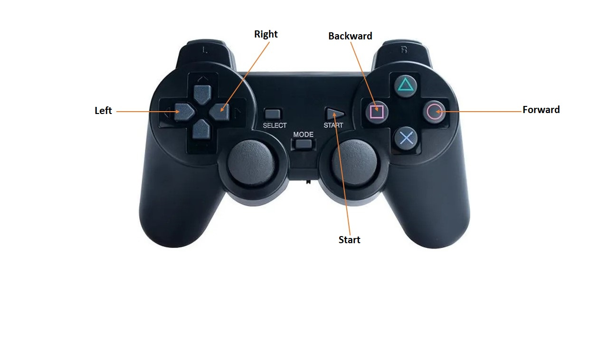
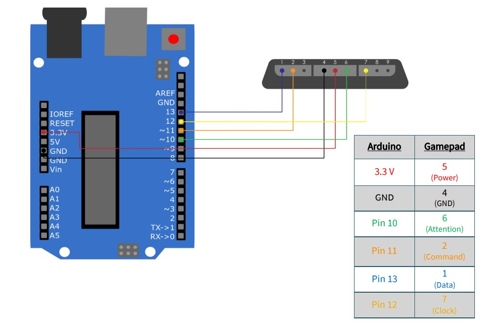
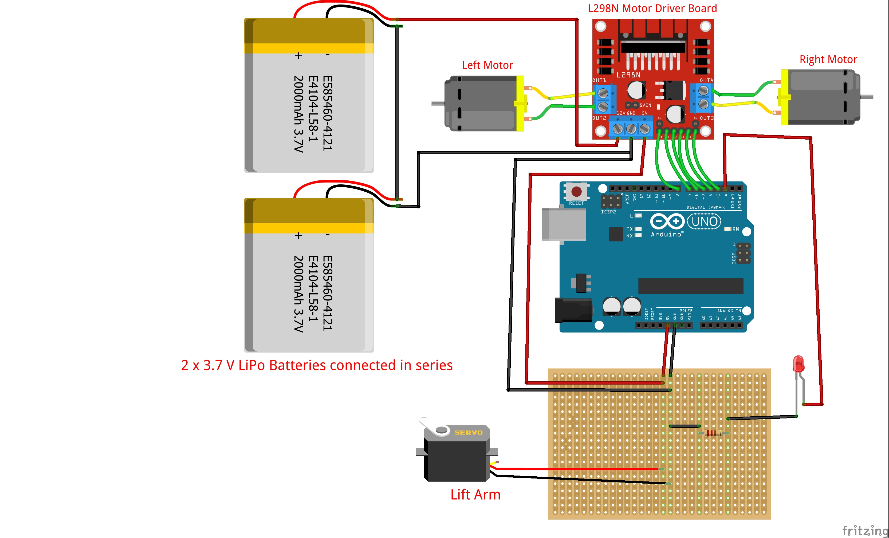

# Fighting_robot

## Project Description

As part of an initiative to introduce robotics to new members of my student association Galiléo, I have decided to develop a combat robot that can move and flip over its opponents. The robot is composed of two robots, each equipped with a wireless gamepad. The robot is powered by 2 motors, a receiver module, an Arduino, and a 9V battery. The robot is controlled by a wireless gamepad.

## Materials
- 2 DC motors
- 1 servo motor
- 1 receiver module
- wireless gamepad
- Arduino Uno
- 9V battery
- spare parts
- LED
- driver

## Software
- Arduino IDE

## Assembly

## Robot Control

## Assembly of Components
### Transmitter Assembly

### Rest of the Robot Assembly

The placement of components is flexible, as long as the connections are respected.

## References

- https://github.com/Lynxmotion/Arduino-PS2X

- https://joy-it.net/en/products/SBC-WLGamepad

- https://www.fingertechrobotics.com/proddetail.php?prod=ft-viper-v2

