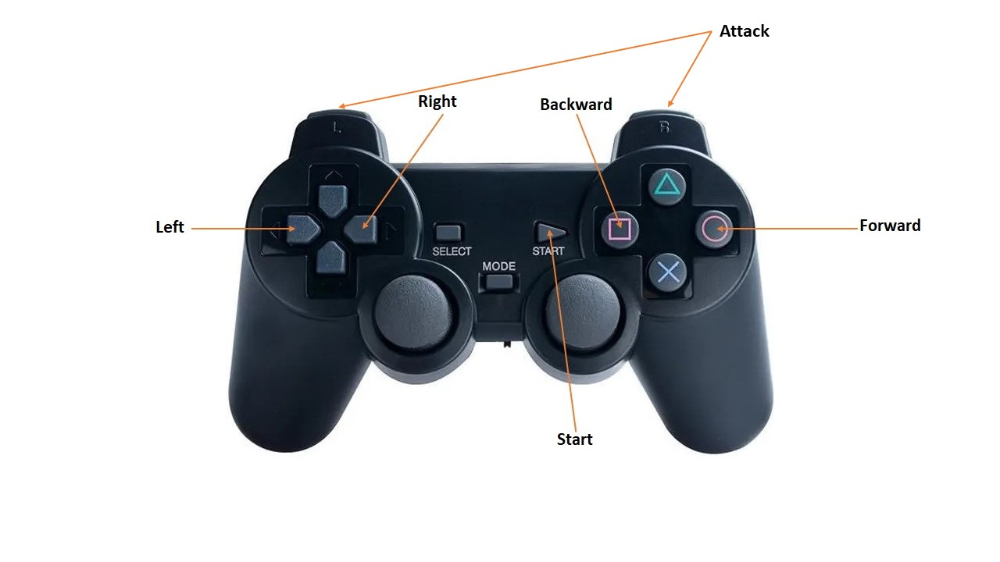

# Fighting_robot

références: 

- https://github.com/Lynxmotion/Arduino-PS2X

https://joy-it.net/en/products/SBC-WLGamepad

## Description du projet

Dans le cadre d'ouverture à la robotique pour les nouveaux membres de mon association étudiante Galiléo, j'ai décidé de développer un robot de combat qui se déplace et renverse ses adversaires. 
Il est composé de 2 robots, chacun équipé d'un gamepad sans fil. Le robot est équipé de 2 moteurs, d'un module de réception, d'un arduino et d'une batterie 9V. 
Le robot est contrôlé par un gamepad sans fil.

## Matériel
- 2 moteurs DC 
- 1 servo-moteur 
- 1 module de réception
- gamepad sans fil
- Arduino Uno
- batterie 9V
- pièces détachées
- LED
- driver

## Logiciel
- Arduino IDE

## Montage

## Contrôle du robot

## Montage des composants

